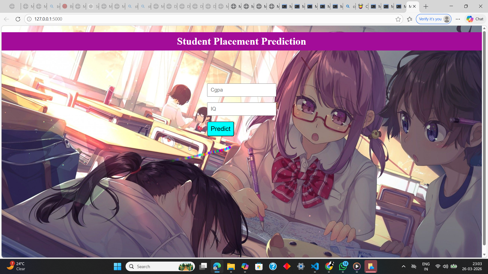
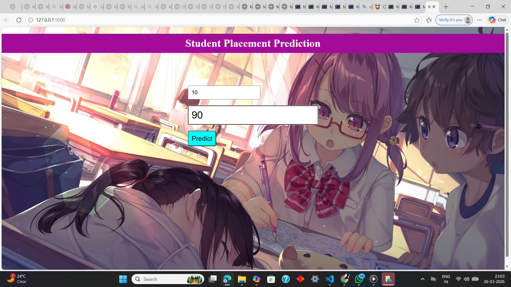
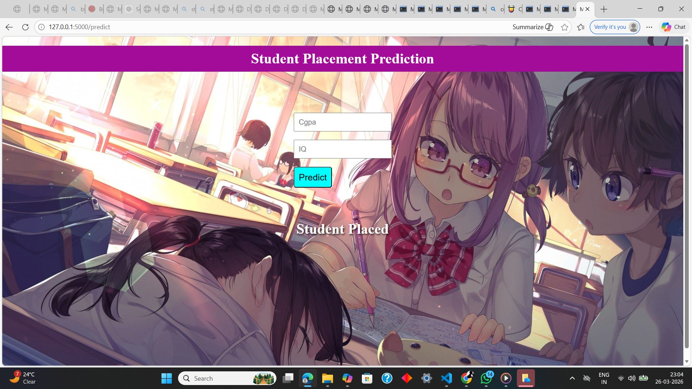
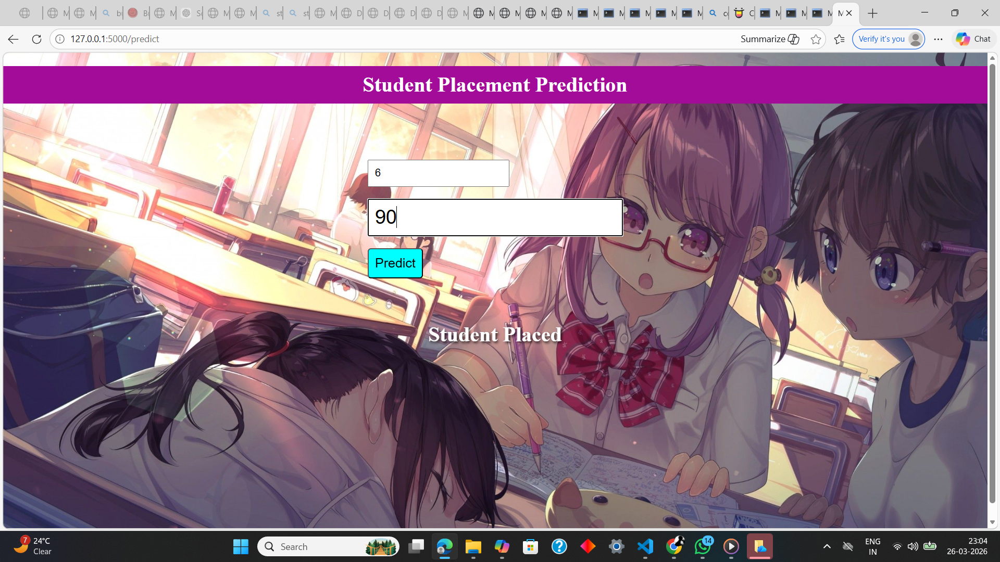
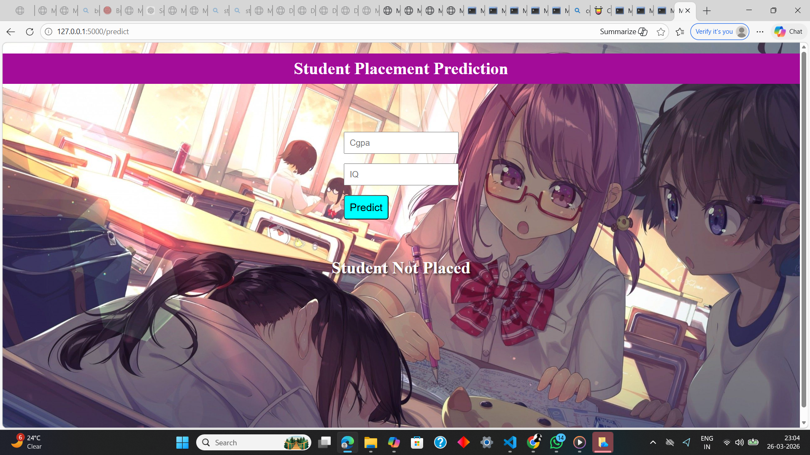

<h1>🎓 Student Placement Prediction System <h1>

An end-to-end Machine Learning web application that predicts whether a student will be placed based on key features like CGPA and IQ.
Built using Flask, this project transforms a trained ML model into a real-time interactive web app.

🚀<h2> Features <h2>
🔍 Predict placement chances instantly

🌐 Flask-powered backend

📊 Machine Learning model integration (.pkl)

🎯 Simple and clean user interface

⚡ Fast inference with minimal input

📸<h2> Project Preview <h2>
🖥️ Web Interface
Add your screenshot here (form with CGPA & IQ input)

📊 Prediction Output
 screenshot showing prediction result

🤖 Machine Learning Workflow
🔹 Data Processing
Feature selection (CGPA, IQ)

Cleaned and structured dataset

🔹 Model
Trained using Scikit-Learn

Saved model using Pickle (pipe.pkl)

🔹 Prediction
Model loaded in Flask backend

Takes user input → returns prediction

🛠️ <h2>Tech Stack<h2>
Category	Technology
Backend	Flask
ML	Scikit-Learn, NumPy, Pandas
Frontend	HTML, CSS
Model File	Pickle (pipe.pkl)
📂 <h2>Project Structure<h2>
├── static/                # CSS, JS, assets
├── templates/             # HTML files
│   └── index.html
├── app.py                 # Flask backend
├── pipe.pkl               # Trained ML model
├── placementprediction.py # Model training script
├── requirement.txt        # Dependencies
└── README.md
⚙️ Installation & Setup
🔧 Prerequisites
Python 3.x

pip

▶️ <h2>Steps to Run<h2>
# Clone the repository
git clone https://github.com/your-username/placement-prediction.git

# Navigate to folder
cd placement-prediction

# Install dependencies
pip install -r requirement.txt

# Run the app
python app.py
🌐 Open in Browser
http://127.0.0.1:3000
💡 Challenges Faced
⚠️ Encoding Error
Faced SyntaxError: invalid character issue

✔ Fixed by ensuring proper UTF-8 encoding

⚠️ Model Integration
Difficulty loading .pkl model

✔ Resolved using correct pickle.load() usage

📈 Future Improvements
🔥 Add more input features (skills, projects, etc.)

🌍 Deploy on cloud (Render / Railway)

📊 Add probability score instead of binary output

🎨 Improve UI/UX

🤝 Contributing
Feel free to contribute!

# Fork the repo
# Create a new branch
# Make changes
# Submit PR
📜 License
This project is open-source under the MIT License.

⭐ Support
If you like this project:

⭐ Star the repo
🍴 Fork it
<h1>📢 Share it</h1>

